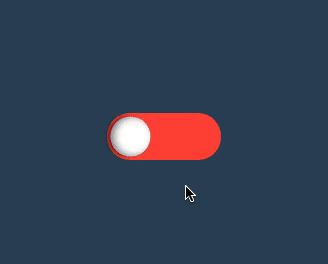

# Animation-button-switch

### Desktop/mobile

  

## 📢 Visite o site

[Animation-button-switch](https://lobinhodev.github.io/Animation-button-switch/).

## 🧠 Tecnologias

Esse projeto foi desenvolvido com as seguintes tecnologias:

-   HTML
-   CSS

(<a href="#top">back to top</a>)

## 💻 Projeto

Botão interativo com animação.

(<a href="#top">back to top</a>)

---

Feito com ♥ by Robotdeveloper 🤖
